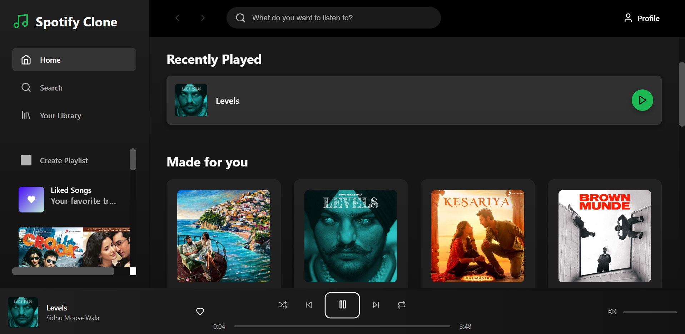
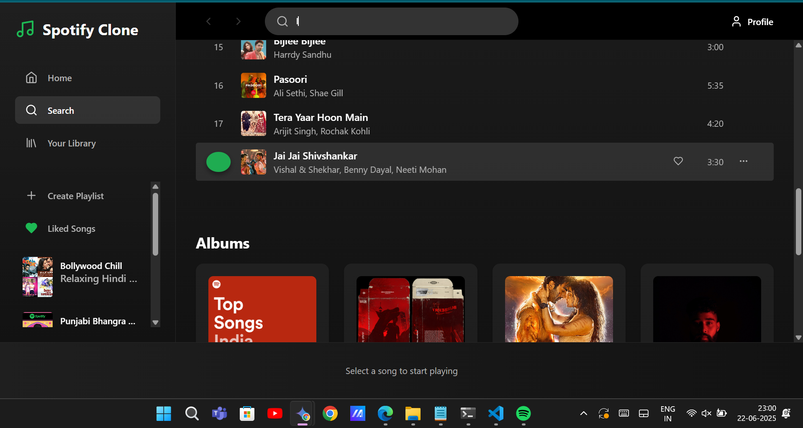
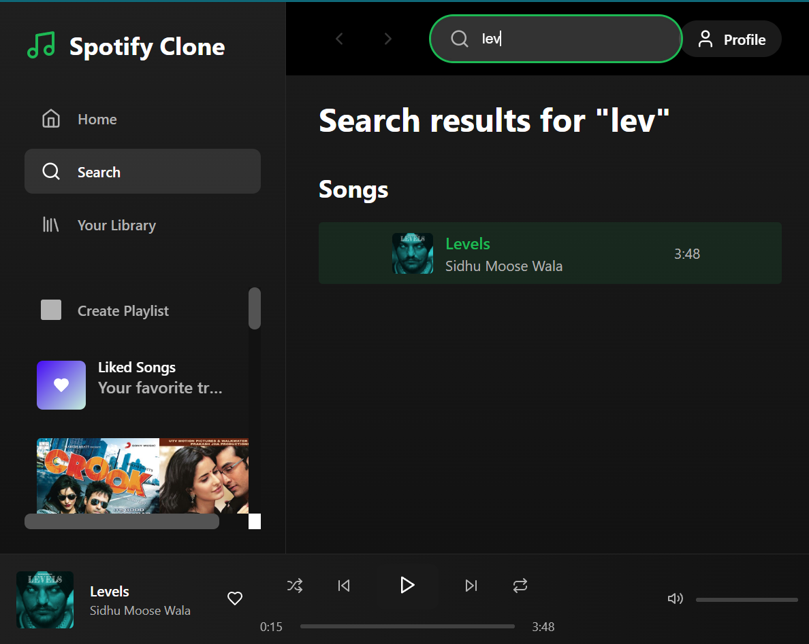
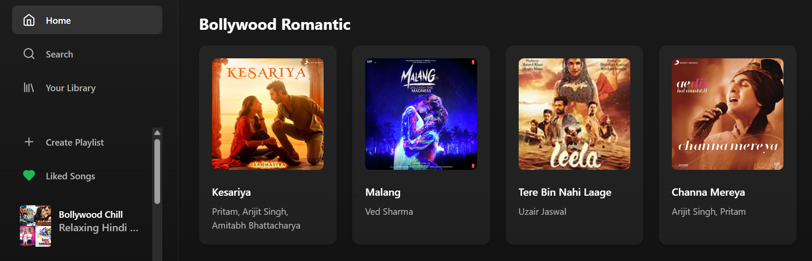
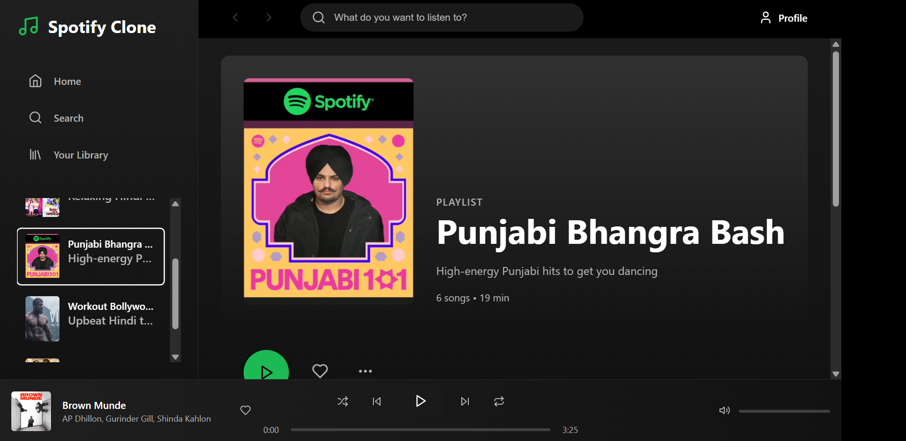
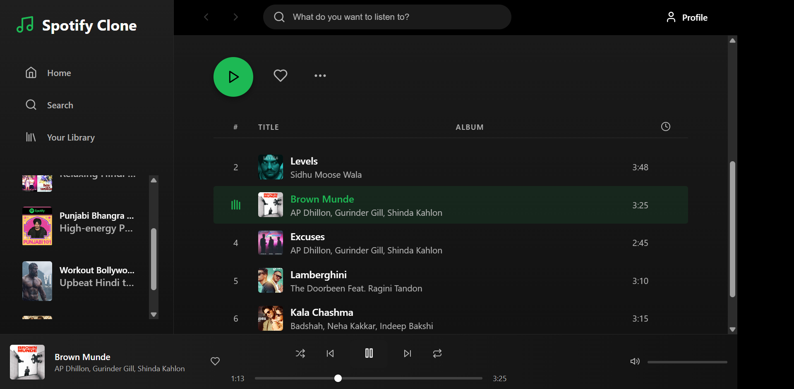

# 🎵 Spotify 2.0 Clone

A modern, frontend-only music player app inspired by Spotify, crafted with React.js, Tailwind CSS, and local mock data for a seamless demo experience.

---

## ✨ Features

- **Home/Discover**: Browse mock "Top Charts" showcasing trending tracks.  
- **Search**: Search through local mock data for songs and artists.  
- **Music Player**: Control playback with play/pause, next/previous, volume, and progress bar.  
- **Browse**: Explore curated dummy data for Playlists, Albums, and Genres.  

---

## 🚀 Tech Stack

- **React.js**: Dynamic and responsive user interface.  
- **Tailwind CSS**: Sleek, modern styling for a Spotify-like look.  
- **Redux**: Efficient state management for seamless interactions.  

---

## 🏃‍♀️ Get Started

1. Clone the repository:  
   ```bash
   git clone https://github.com/Akshat090803/Spotify-Clone-Assignment.git
   ```
2. Navigate to the project directory:  
   ```bash
   cd Spotify-Clone-Assignment
   ```
3. Install dependencies and start the development server:  
   ```bash
   npm install
   npm start
   ```

---

## 📸 UI Screenshots

### 🏠 Home


---

### 🔍 Search
  


---

### 🎸 Genres
  


---

### 🎧 Playlists
  


---
