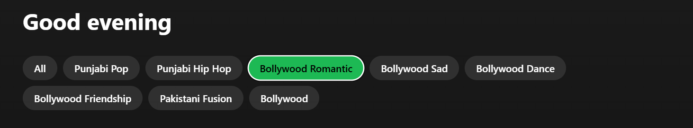

# Spotify 2.0 Clone

A frontend-only music player app, inspired by Spotify, built with React.js and local data for demonstration.

---

## ✨ Features

* **Home/Discover:** Mock "Top Charts".
* **Search:** Local mock data for songs/artists.
* **Music Player:** Playback controls (play/pause, next/previous, volume, progress).
* **Browse:** Dummy data for Playlists, Albums, & Genres.

---

## 🚀 Tech

* React.js
* Redux

---

## 🏃‍♀️ Get Started

1. Clone repo: `git clone https://github.com/Akshat090803/Spotify-Clone-Assignment.git`
2. `cd Spotify-Clone-Assignment`
3. Run in a React development environment.

---

## 📸 UI Screenshots

### Home

### Search

### Genres

### Playlists

